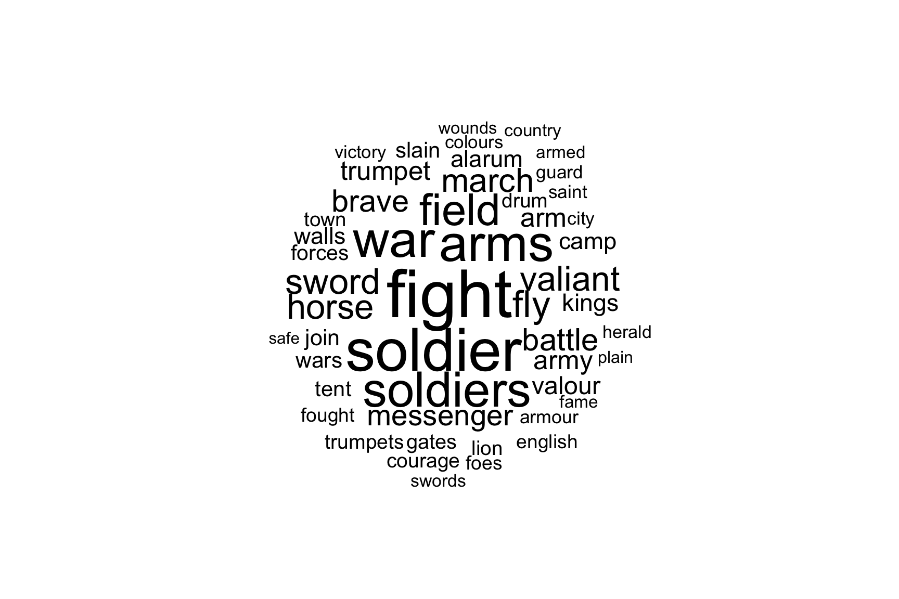
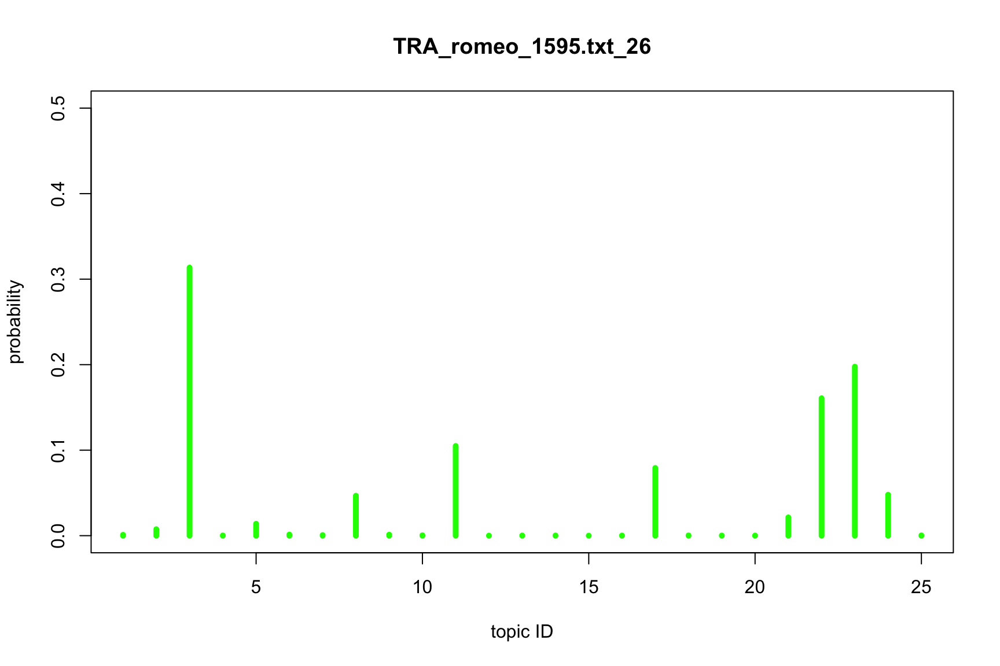
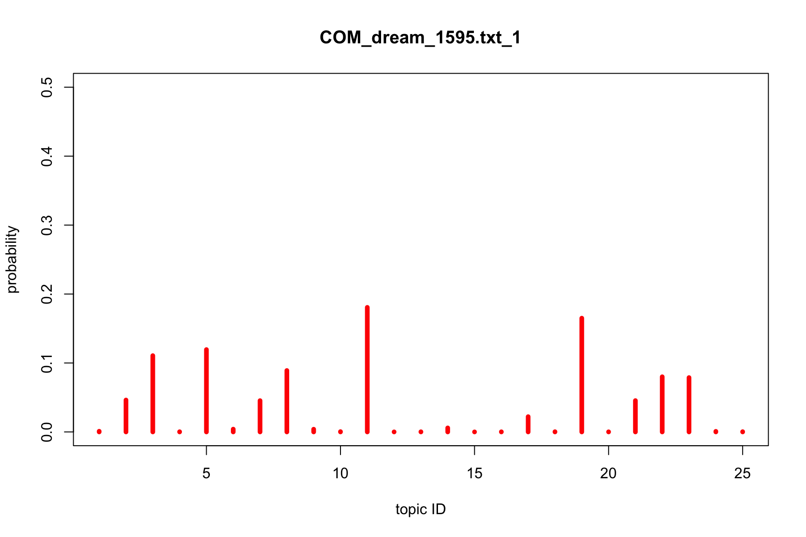

# A Workshop in Topic Modeling


**Author:** Maciej Eder<br/>
**License:** [GPL-3](https://opensource.org/licenses/GPL-3.0)


## Overview

* [Introduction](#introduction)
* [What is topic modeling?](#what-is-topic-modeling)
* [Dataset preparation](#dataset-preparation)
* [DARIAH Topic Explorer](#dariah-topic-explorer)
* [R and the package Mallet](#r-and-the-package-mallet)
* [Online tutorials](#online-tutorials)
* [Bibliography](#bibliography)
* [References](#references)


## Introduction

This tutorial provides a very concise introduction to topic modeling. It is assumed that the user exhibits some familiarity with general concepts behind topic models. It might be profitable to consult the resources listed at the bottom of this document, in the section [**Online tutorials**](#online-tutorials). Also, the tutorial itself is supplemented by [this presentation](https://computationalstylistics.github.io/presentations/topic_modeling_intro/intro_to_topic_models.html), in which possible applications of topic modeling are discussed, and a few introductory remarks about the method itself are provided.

The tutorial will cover basic functionalities of the [DARIAH topic explorer](https://dariah-de.github.io/TopicsExplorer/) software. As a dummy dataset, the Shakesperean canon will be used in the form of [raw text files](https://github.com/computationalstylistics/topic-modeling-workshop/tree/master/shakespeare_genre/corpus). In the second part, the same dataset will be used to train a topic model using the programming language R and the package [R mallet](https://cran.r-project.org/web/packages/mallet/index.html).


## What is topic modeling?

Topic modeling is a machine-learning technique aimed at discovering hidden thematic structures in large collections of texts. What makes this technique special, is that it belongs to distributional semantics paradigm – this means that the method doesn’t rely on any prior knowledge about word meanings. Rather, it uses the information about word frequencies and word co-occurrencies, to discover semantic relations between groups of words referred to as _topics_.

Topic modeling takes advantage of the simple assumption that certain words tend to occur more frequently in a text about a given topic, than in other texts. Next, texts are usually about many topics. Consequently, a topic is a recurring pattern of co-occurring words. To quote David Blei (2012: 78), one of the authors of the topic modeling technique:

> We formally define a _topic_ to be a distribution over a fixed vocabulary. For example, the _genetics_ topic has words about genetics with high probability and the evolutionary biology topic has words about _evolutionary biology_ with high probability. 

More specifically, each topic in a corpus is a distribution over words, each text is a mixture of corpus-wide topics, and each word is drawn from one of those topics. In the real world, however, we only observe the texts and the words occurring in the texts; all the other characteristics of the texts are hidden variables, to be inferred by a generative model.

There are a few methods to perform topic modeling, the most popular of them being LDA, or latent Dirichlet allocation (Blei, 2003). The LDA method has several implementations, the following ones are relatively simple to use, and thus recommended for humanities scholars: 

* [Mallet](http://mallet.cs.umass.edu/) (Java)
* [Stanford Topic Modeling Toolbox](https://nlp.stanford.edu/software/tmt/tmt-0.4/) (Java)
* [gensim](https://radimrehurek.com/gensim/) (Python)
* [lda](https://github.com/lda-project/lda) (Python)
* [topicmodels](https://cran.r-project.org/web/packages/topicmodels/index.html) (R)
* [Mallet invoked from R](https://cran.r-project.org/web/packages/mallet/index.html) (R + Java)
* [DARIAH Topic Explorer](https://dariah-de.github.io/TopicsExplorer/) (standalone)

In this tutorial, we’ll focus mosty on the simplest tool listed above, namely DARIAH Topic Explorer.


## Dataset preparation

Topic modeling is designed to analyze large collections of texts (documents). Leaving aside the question how large such a collection should be, we’ll focus on a dummmy corpus containing the works by Shakespeare. It can be found in the current GitHub repository, in the subdirectory [`corpus`](https://github.com/computationalstylistics/topic-modeling-workshop/tree/master/shakespeare_genre/corpus).

The files contain plain texts, one play per file. The procedure will automatically tokenize the strings of characters into words (let’s skip here a non-trivial discussion of how the contractions and/or compound words should be treated), which is followed by punctuation marks removal, as well as by convertion of capital letters into lowercase.

What is important to know before a topic modeling algorithm is applied, is that the order of words is not relevant for the method. A text sample becomes a “bag of words”, in which only word frequencies and word co-occurrencies matter. Essentially, this means that the relation between any adjacent words in _Hamlet_ by Shakespeare is as meaningful as the relation between the very first and the very last word from the tragedy. Certainly, this holds when _Hamlet_ is analyzed as a monolithic text; different word co-occurence patterns will be discovered when the text is sliced into smaller samples. We’ll compare the quality of topic models based on entire texts and on chunked texts below. The subdirectory [`corpus_1000-word_samples`](https://github.com/computationalstylistics/topic-modeling-workshop/tree/master/shakespeare_genre/corpus_1000-word_samples) contains the Shakespearean corpus with texts sliced into 1000-word chunks. 

Secondly, the order of documents (be it texts or text chunks) is not relevant for the method. It doesn’t matter if _Hamlet_ is analyzed as the first or as the last document in the collection. This is a good news for us, because one doesn’t need to care about filenames of the documents: should the files be alphabetized or not, it won’t affect the model. Thirdly, the number of topics is fixed and known in advance.

Once the pre-processing of the input texts is done, the procedure optionally exludes some words, referred to as stopwords, from the analysis. This is highly recommended to exclude at least very frequent function words (articles, particles, prepositions), but also some common adverbs and pronouns. A generic list of English stopwords can be found [here](https://github.com/computationalstylistics/topic-modeling-workshop/blob/master/shakespeare_genre/en.txt). It begins as follows:


```
a
able
about
above
according
accordingly
across
actually
after
afterwards
again
against
all
allow
allows
almost
alone
...
```


   

## DARIAH Topic Explorer

[DARIAH topic explorer](https://dariah-de.github.io/TopicsExplorer/) is a very simple tool, yet somewhat limited when it comes to its functionalities. It requires no programming knowledge and no additional software needs to be installed. In short, it’s a perfect choice to train your first topic model in no time, but sooner of later you’ll probably decide to switch to some more sophisticated options. E.g., check the [next section](#r-and-the-package-mallet) of this tutorial. To use DARIAH Topic Explorer:

* Download the [executable file](https://github.com/DARIAH-DE/TopicsExplorer/releases/tag/v2.0) matching your operating system,
* Launch the program,
* Choose the text files to be scrutinized by the LDA algorithm: in our case, it will be the texts by Shakespeare to be found in the subdirectory [`corpus`](https://github.com/computationalstylistics/topic-modeling-workshop/tree/master/shakespeare_genre/corpus).
* This is basically enough to start building a topic model, although some additional tweaks will help improve the model’s quality (see below).


The default settings do provide some results, but we’d love to have more control on the parameters of the model. First comes the number of topics. The DARIAH Topic Explorer has a default value of 10 topics. However, such a low number of topics to be inferred from the rich Shakespearean dataset, might be not enough to discover its thematic structure. Leaving aside a discussion what the optimal number of topics might be (see Griffiths and Steyvers 2004), the arbitrary value of 25 topics will be used throughout this tutorial. You’ll encouraged, however, to experiment with other values as well. 

Another parameter of the model is the list of stopwords. You can either specify a number of the most frequent words (the default value being 100), or provide your own list of stopwords. Try to use the file [`en.txt`](https://github.com/computationalstylistics/topic-modeling-workshop/blob/master/shakespeare_genre/en.txt), and train the model again, to see the difference.

Particular topics are far better now, althouth it is difficult to define what “better” really means in this context. At least, the topics _look_ better for a human observer. However, most of the topics revolve around the words in which we can recognize names of Shakespearean characters. And indeed, it turns out that the speakers’ names were all taken into account when inferring the topics. For instance, an excerpt from _The Merchant of Venice_ looks as follows:


```
ACT 1.
SCENE I. Venice. A street
[Enter ANTONIO, SALARINO, and SALANIO]
ANTONIO.
In sooth, I know not why I am so sad;
It wearies me; you say it wearies you;
But how I caught it, found it, or came by it,
What stuff 'tis made of, whereof it is born,
I am to learn;
And such a want-wit sadness makes of me
That I have much ado to know myself.
SALARINO.
Your mind is tossing on the ocean;
There where your argosies, with portly sail--
Like signiors and rich burghers on the flood,
Or as it were the pageants of the sea--
Do overpeer the petty traffickers,
That curtsy to them, do them reverence,
As they fly by them with their woven wings.
```

We would definitely like to exlude the words `ANTONIO` and `SALARINO` from the analysis, because they will bias the results. By extention, we’d like to exclude the all-capital-letter words. It solves the problem, but only partially. The following fragment from _Hamlet_ shows a different way of indicating the speakers:

```
SCENE. Elsinore.
ACT I.
Scene I. Elsinore. A platform before the Castle.
[Francisco at his post. Enter to him Bernardo.]
Ber.
Who's there?
Fran.
Nay, answer me: stand, and unfold yourself.
Ber.
Long live the king!
Fran.
Bernardo?
Ber.
He.
Fran.
You come most carefully upon your hour.
Ber.
'Tis now struck twelve. Get thee to bed, Francisco.
Fran.
For this relief much thanks: 'tis bitter cold,
And I am sick at heart.
​
```

A very rough list of Shakespearean names, including the abbreviated forms, are saved into the file [`names_shakespeare.txt`](https://github.com/computationalstylistics/topic-modeling-workshop/blob/master/shakespeare_genre/names_shakespeare.txt). Try to add these names to the stopword list and re-traing the model. Again, the topics seem to be better, or at least more content-related, but still something is wrong here... To cut long story short, there are still some stopwords to be removed, and these include mostly archaic forms (e.g. _thou_, _thy_, _thee_, _hath_, _doth_), stage directions (e.g. _enter_ or _exeunt_), and some corpus-specific contractions. The list of these stopwords can be found in the file [`stopwords_shakespeare.txt`](https://github.com/computationalstylistics/topic-modeling-workshop/blob/master/shakespeare_genre/stopwords_shakespeare.txt). 

Try to play with the above three different stopword lists, to see how the respective models differ. Try also to combine all the stopwords into one – or simply use the file [`combined_stopwords.txt`](https://github.com/computationalstylistics/topic-modeling-workshop/blob/master/shakespeare_genre/combined_stopwords.txt). We’re definitely getting somewhere, even if an uneasy question becomes more and more evident: So, do I have to manipulate my stopword list until my topics look OK? Well, there exist more sophisticated ways of excluding stopwords, such as tf/idf weighting, but they won’t be covered in this tutorial. 


   
- text chunking
- optimal number of topics


## R and the package Mallet

No matter how simple the DARIAH Topic Explorer is as a tool, it is also rather limited in terms of its functionalities. To have more (much more!) control on the entire proces of text pre-processing, chunking, excluding stopwords, training the topic model, visualizing the topics, observing the correlations between documents, etc., you might want to dive into the fascinating world of programming languages. Below, a litle bit of coding in R is shown. The code is based on the package `mallet` (an R wrapper for the original [Mallet](http://mallet.cs.umass.edu/) written in Java). The text pre-processing stage, however, is done with some help of the package `stylo`, whereas wordcloud visualizations of the topics is taken over by the package `wordclouds`. These packages need to be installed alongside the R shell. Please mind the first lines of the following code, where the parameters of the model, including the number of topics, the sample size, and the directory containing text files are specified:


``` R
# first, some variables should be set

# number of topics to be inferred
no.of.topics = 25
# number of iterations (epochs) in the training stage
train_iterations = 200
# a directory containing text files
directory = "corpus"
# slicing the texts into samples of N words
sample_size = 1000
# the file containing stopwords
stopwords = "combined_stopwords.txt"


# when the corpus is big, the default memory allocation might be not enough;
# the following option increases the Java memory to 4Gb
options(java.parameters = "-Xmx4g")

# invoking relevant R libraries
library(stylo)
library(mallet)
library(wordcloud)


# loading the corpus as is
raw.corpus = load.corpus(files = dir(), corpus.dir = directory)
# splitting the texts into words
parsed.corpus = parse.corpus(raw.corpus)
# splitting the texts into equal-sized samples
sliced.corpus = make.samples(parsed.corpus, sampling = "normal.sampling", sample.size = sample_size)
# since Mallet prefers to split the texts iteself, joining the words into space-delimited strings
deparsed.corpus = sapply(sliced.corpus, paste, collapse = " ")


# invoking Mallet: first importing the texts
mallet.instances = mallet.import(id.array = names(deparsed.corpus), 
         text.array = deparsed.corpus, stoplist.file = stopwords,
         token.regexp = "[A-Za-z]+")

# create a topic trainer object
topic.model = MalletLDA(num.topics = no.of.topics)

# load the texts/samples
topic.model$loadDocuments(mallet.instances)

# get the vocabulary, and some statistics about word frequencies
vocabulary = topic.model$getVocabulary()
word.freqs = mallet.word.freqs(topic.model)

# optimize hyperparameters every 20 iterations, after 50 burn-in iterations.
topic.model$setAlphaOptimization(20, 50)

# train a model, using the specified number of iterations
topic.model$train(train_iterations)

# run through a few iterations where we pick the best topic for each token,
# rather than sampling from the posterior distribution.
topic.model$maximize(10)

# Get the probability of topics in documents and the probability of words in topics.
# By default, these functions return raw word counts. Here we want probabilities,
# so we normalize, and add "smoothing" so that nothing has exactly 0 probability.
doc.topics = mallet.doc.topics(topic.model, smoothed = TRUE, normalized = TRUE)
topic.words = mallet.topic.words(topic.model, smoothed = TRUE, normalized = TRUE)

# now, add words' IDs and samples' IDs to both tables
colnames(topic.words) = vocabulary
# names of the samples
rownames(doc.topics) = names(deparsed.corpus)
# names of the topics: actually, simple numeric IDs
colnames(doc.topics) = 1:length(doc.topics[1,])
```

At this point, the model is trained. The proportions of words in particular topics are stored in the variable `topic.words`, whereas the proportions of topics in documents (text chunks, to be precise) are in the variable `doc.topics`. What about producing a wordcloud out of 50 top words from the 6th topic? Copy-paste the following snippet:


``` R
############## Exploration of the dataset

# to get N words from Xth topic
no.of.words = 50
topic.id = 6
current.topic = sort(topic.words[topic.id,], decreasing = T)[1:no.of.words]

# to make a wordcloud out of the most characteristic topics
wordcloud(names(current.topic), current.topic, random.order = FALSE, rot.per = 0)

```





Please keep in mind that in your case, the numbers assigned to the topics will probably be different. This is due to the fact that the LDA algorithm assigns the topics IDs randomly. Moreover, the word proportions in particular topics might differ as well, due to the random seeding of the word proportions at the first interation. Saving a plot in R is a bit more tricky, and saving all possible plots (all the topics) might be cumbersome. The following snippet involves a loop that does the trick:


``` R
no.of.words = 50
for(i in 1 : no.of.topics) {
    topic.id = i
    current.topic = sort(topic.words[topic.id,], decreasing = T)[1:no.of.words]
    png(file = paste("topic_", topic.id, ".png", sep = ""))
    wordcloud(names(current.topic), current.topic, random.order = FALSE, rot.per = 0)
    dev.off()
}

```

Caveat emptor: the files will be saved in your current directory without checking what’s in that directory. It can clutter your hard-drive and/or overwrite the exsting files!


`rownames(doc.topics)`


plot a sample from _Hamlet_ (sample #23, which is sample #750)

the ending of the King Lear (808)

the climax of the _Romeo and Juliet_ (880)


``` R

# to plot the proportions of topics in the Xth sample
no.of.sample = 880
plot(doc.topics[no.of.sample,], type = "h", xlab = "topic ID", ylab = "probability", ylim = c(0, 0.5), main = rownames(doc.topics)[no.of.sample], lwd = 5, col = "green")

```





What about the beginning of _A Midsummer Night’s Dream_?


```R
# to plot the proportions of topics in the Xth sample
no.of.sample = 626
plot(doc.topics[no.of.sample,], type = "h", xlab = "topic ID", ylab = "probability", ylim = c(0, 0.5), main = rownames(doc.topics)[no.of.sample], lwd = 5, col = "blue")

```





``` R

stylo(frequencies = doc.topics, gui = FALSE, dendrogram.layout.horizontal = FALSE)

stylo(frequencies = doc.topics, gui = FALSE, analysis.type = "PCR")

stylo(frequencies = doc.topics, gui = FALSE, analysis.type = "PCR", text.id.on.graphs = "points")
```


## Online tutorials

* [Oh A. (2010). Topic Models Applied to Online News and Reviews](https://www.youtube.com/watch?v=1wcX4fEdNUo) (YouTube)
* [Mimno (2012), Topic Modeling Workshop](https://vimeo.com/53080123) (Vimeo)
* [Jockers, Nelson (2012), Topic Modeling Workshop](https://vimeo.com/52959139) (Vimeo)
* [Guldi, Johnson-Roberson (2012), Topic Modeling Workshop](https://vimeo.com/53078693) (Vimeo)
* [Brett M. (2012), Topic Modeling: A Basic Introduction](http://journalofdigitalhumanities.org/2-1/topic-modeling-a-basic-introduction-by-megan-r-brett/)
* [Jockers, The LDA Buffet is Now Open](http://www.matthewjockers.net/2011/09/29/the-lda-buffet-is-now-open-or-latent-dirichlet-allocation-for-english-majors/) (LDA explained in a form of a literary fable)
* [Underwood, Topic modeling made just simple enough](https://tedunderwood.com/2012/04/07/topic-modeling-made-just-simple-enough/)
* [Topic Modeling in the Humanities](https://mith.umd.edu/topic-modeling-in-the-humanities-an-overview/)
* [Scott Weingart’s posts on Topic Modeling](http://scottbot.net/tag/topic-modeling/)
* [David Blei’s webpage](http://www.cs.columbia.edu/~blei/topicmodeling.html)
* [Text Mining with R](https://www.tidytextmining.com/)
* [Topic Models Learning and R Resources](https://github.com/trinker/topicmodels_learning)


## Bibliography

* [Topic Modeling Bibliography](https://mimno.infosci.cornell.edu/topics.html)


## References

**Blei, D.M.** (2012). [Probabilistic topic models](http://delivery.acm.org/10.1145/2140000/2133826/p77-blei.pdf). _Communications of the ACM_, **55**(4): 77–84.

**Blei, D.M., Ng, A.Y. and Jordan, M.I.** (2003). [Latent Dirichlet allocation](http://jmlr.csail.mit.edu/papers/v3/blei03a.html). _Journal of Machine Learning Research_. **3**: 993–1022.

**Griffiths, T. L. and Steyvers, M.** (2004). Finding scientific topics. _Proceedings of the National Academy of Sciences_, **101**(Suppl. 1): 5228–35 doi:10.1073/pnas.0307752101.
